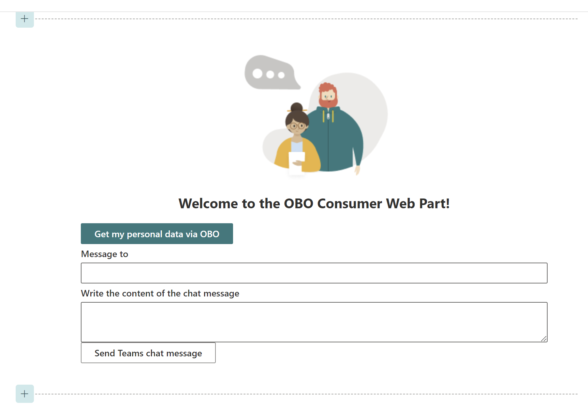

# Using the Azure AD on-behalf-of flow within your SharePoint Framework solution

## Summary

This is a sample solution that illustrates how to invoke a middleware Web API/service, from a SharePoint Framework solution, relying on the On-Behalf-Of (OBO) flow in order to consume a backend Web API/service.

Here you can see a functional diagram of the OBO grant flow:

## Applies to

- [SharePoint Framework](https://aka.ms/spfx)
- [Microsoft Viva Connections](https://www.microsoft.com/en-us/microsoft-viva/connections)
- [Microsoft 365 tenant](https://docs.microsoft.com/en-us/sharepoint/dev/spfx/set-up-your-developer-tenant)

> Get your own free development tenant by subscribing to [Microsoft 365 developer program](http://aka.ms/o365devprogram)

## Documentation
You can find additional technical details about the OBO grant flow reading the [Microsoft identity platform and OAuth 2.0 On-Behalf-Of flow](https://learn.microsoft.com/en-us/azure/active-directory/develop/v2-oauth2-on-behalf-of-flow) document.

## Prerequisites

The SPFx solution relies on a middleware APIs built with .NET 6. The source code of the APIs is available [here](./spfx-obo-middleware) in this repository. You will find two Azure Functions:
- *GetPersonalData*: takes care of retrieving current user's personal data (UPN and Inbox metrics) using On-Behalf-Of flow with explicit code in the function.
- *SendTEamsChatMessage*: takes care of sending a teams message in a 1:1 chat relying on some Azure Functions middleware extensions, in order to ease the development process of the function itself and to provide a reusable solution.

The SPFx solution is available [here](./spfx-obo-consumer) in this repository.

## Solution

Solution|Author(s)
--------|---------
SPFx OBO | Paolo Pialorsi - [PiaSys.com](https://www.piasys.com/) - [@PaoloPia](https://twitter.com/PaoloPia)

## Version history

Version|Date|Comments
-------|----|--------
1.0|October 20, 2022|Initial release

## Disclaimer

**THIS CODE IS PROVIDED *AS IS* WITHOUT WARRANTY OF ANY KIND, EITHER EXPRESS OR IMPLIED, INCLUDING ANY IMPLIED WARRANTIES OF FITNESS FOR A PARTICULAR PURPOSE, MERCHANTABILITY, OR NON-INFRINGEMENT.**

---

## Minimal Path to Awesome
Follow [this link](./docs/MinimalPathToAwesome.md) learn how to deploy this sample solution.

## Features

The ACEs included in this project allow you to:
- browse a list of demo orders, via the ListOrders ACE
- browse and manage (add, update, delete) a list of demo orders, via the ManageOrders ACE

## References

- [Extend Microsoft Viva Connections Learn Path](https://aka.ms/m365/dev/learn/connections)
- [Getting started with SharePoint Framework](https://docs.microsoft.com/en-us/sharepoint/dev/spfx/set-up-your-developer-tenant)
- [Building for Microsoft teams](https://docs.microsoft.com/en-us/sharepoint/dev/spfx/build-for-teams-overview)
- [Use Microsoft Graph in your solution](https://docs.microsoft.com/en-us/sharepoint/dev/spfx/web-parts/get-started/using-microsoft-graph-apis)
- [Connect to Azure AD-secured APIs in SharePoint Framework solutions](https://learn.microsoft.com/en-us/sharepoint/dev/spfx/use-aadhttpclient)
- [Microsoft identity platform and OAuth 2.0 On-Behalf-Of flow](https://learn.microsoft.com/en-us/azure/active-directory/develop/v2-oauth2-on-behalf-of-flow)
- [Microsoft 365 Patterns and Practices](https://aka.ms/m365pnp) - Guidance, tooling, samples and open-source controls for your Microsoft 365 development

